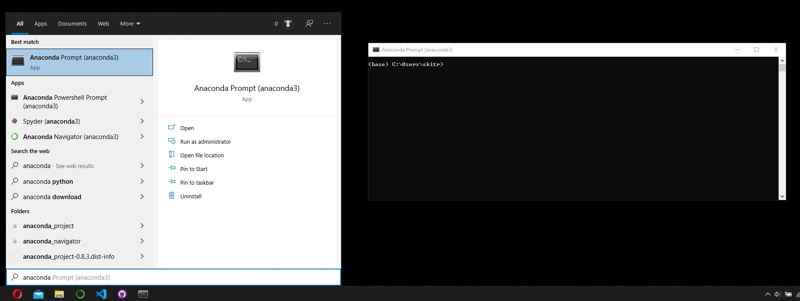

# WisdomGenerator
The goal is to recreate them model made in this [article](https://towardsdatascience.com/how-to-train-and-deploy-custom-ai-generated-quotes-using-gpt2-fastapi-and-reactjs-9a6feb42d8b0)
That is, the goal is the make a Norwegian version of [inspirobot](https://www.instagram.com/inspirobot.me/?hl=en).

## Setup (for Anaconda Windows)
- Install [Anaconda](https://www.anaconda.com)
- Open the Anaconda Promt:

- Make virtuale envirorment: ``conda create -n wisdomgeneratorenv python=3.8.8 anaconda``
- ``conda activate wisdomgeneratorenv``
- ``conda install -c conda-forge transformers==4.4.2``
- Install Pytorch (Antar du har CUDA versjon 11.1, Thomas): ``conda install pytorch torchvision torchaudio cudatoolkit=11.1 -c pytorch -c conda-forge``
- Start spyder by running: ``spyder``
- Navigate to the project folder you have downloaded for git.
- Check that the pretrained model is working by running [test_pretrained_model.py](test_pretrained_model.py).
- Check that the GPU is working by running [check_if_using_gpu.py](check_if_using_gpu.py)
- Start training on a very small data set, to see if it is working [train_on_dummy_data.py](train_on_dummy_data.py)

## Til info:
Når jeg prøver å kjøre treningen så får jeg advarselen og feilen:
```
FutureWarning: This dataset will be removed from the library soon, preprocessing should be handled with the 🤗 Datasets library. You can have a look at this example script for pointers: https://github.com/huggingface/transformers/blob/master/examples/language-modeling/run_mlm.py

Token indices sequence length is longer than the specified maximum sequence length for this model (1168 > 1024). Running this sequence through the model will result in indexing errors

RuntimeError: CUDA out of memory. Tried to allocate 20.00 MiB (GPU 0; 3.00 GiB total capacity; 1.76 GiB already allocated; 17.71 MiB free; 1.88 GiB reserved in total by PyTorch)
```